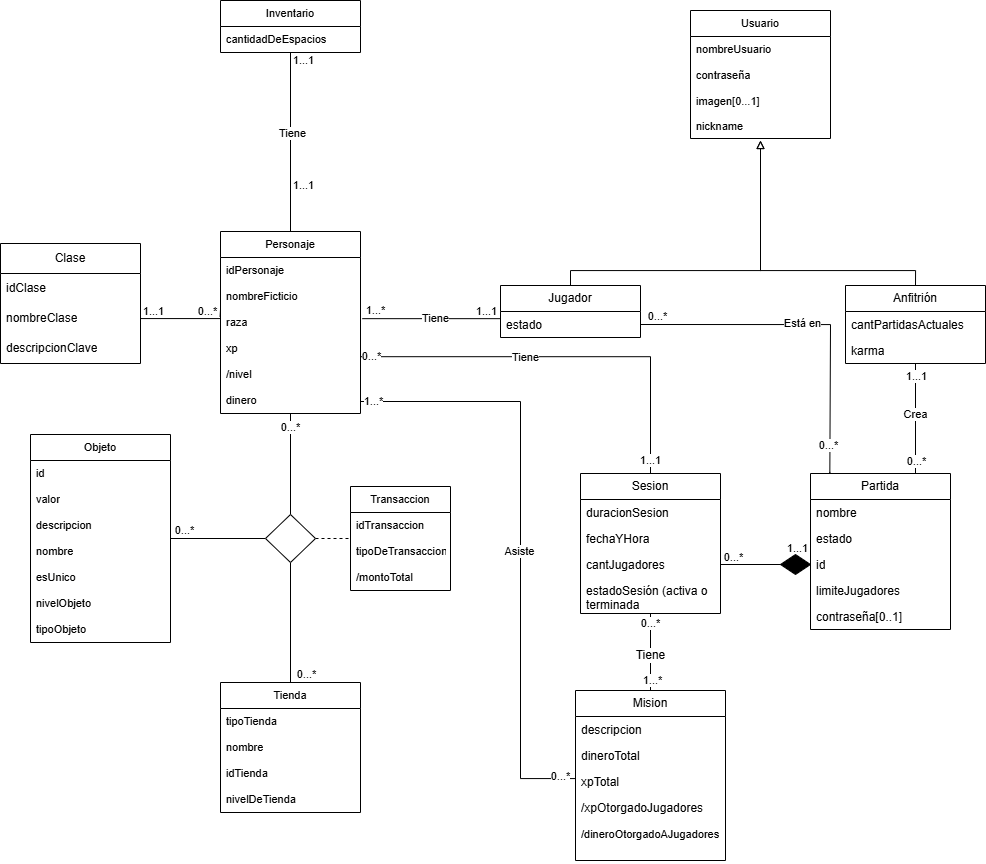

# Propuesta TP DSW

## Grupo
### Integrantes
53958 - Gudiño, Octavio Alejandro  
54241 - Salomon, Emanuel   
54279 - Scollo, Renzo  
54307 - Testi, Franco    
54342 - Ciesco, Alejandro Mario 

### Repositorios
* [frontend app](http://hyperlinkToGihubOrGitlab)
* [backend app](http://hyperlinkToGihubOrGitlab)

## Tema
### Descripción
Trata de un gestor de turnos para partidas de juegos de Rol, con sistema de compra-venta de objetos del juego en las partidas, con registro y logueo tanto para “Jugador” como “Anfitrión” y sistema para crear personajes de rol.

### Modelo
LINK:https://drive.google.com/file/d/1-zXEpOdd3ASk3xKuXXNHCWMKxyeTyydU/view?usp=sharing

## 𝘼𝙡𝙘𝙖𝙣𝙘𝙚 𝙁𝙪𝙣𝙘𝙞𝙤𝙣𝙖𝙡 

### 𝘼𝙡𝙘𝙖𝙣𝙘𝙚 𝙈𝙞́𝙣𝙞𝙢𝙤

Regularidad:
|Req|Detalle|
|:-|:-|
|CRUD simple|1. CRUD Usuario 2. CRUD Objeto 3. CRUD Tienda  4. CRUD Misión  5. CRUD Clase |
|CRUD dependiente|1. CRUD Personaje {Depende de} CRUD Jugador 2. CRUD Jugador {Depende de} CRUD Usuario.  3. CRUD Anfitrion {Depende de} CRUD Usuario |
|Listado + detalle|1. Listado de partidas filtrado por estado (activo), muestra nombre de la partida, su privacidad y anfitrión => detalle de todas las partidas que están siendo hosteadas.   2. Listado de objetos sugeridos filtrado por clase de personaje, muestra nombre del objeto, tipo, valor y si es único => detalle de los objetos que se pueden comprar y coinciden con mi clase.   3. Listado de personajes filtrado por clase, muestra nombre del personaje, jugador asociado, xp, nivel, raza y el id del personaje => detalle de los personajes que poseen el clase elegido. Si no se elige: cualquiera.|
|CUU/Epic|1. Jugar una sesión 2. Gestionar comercialización de objetos  3. Realizar misión|

Adicionales para Aprobación
|Req|Detalle|
|:-|:-|
|CRUD |1. CRUD Usuario 2. CRUD Objeto  3. CRUD Partida  4. CRUD Tienda 5. CRUD Misión 6. CRUD Personaje 7. CRUD Jugador  8.CRUD Sesión  9. CRUD Anfitrión  10. CRUD Inventario|
|CUU/Epic|1. Gestionar inventario 2. Calificar anfitrión 3.Crear personaje  4.Gestionar partida  5.  |

### 𝘼𝙡𝙘𝙖𝙣𝙘𝙚 𝘼𝙙𝙞𝙘𝙞𝙤𝙣𝙖𝙡 𝙑𝙤𝙡𝙪𝙣𝙩𝙖𝙧𝙞𝙤

|Req|Detalle|
|:-|:-|
|Listados |1. |
|CUU/Epic|1.  2. |
|Otros|1. |

